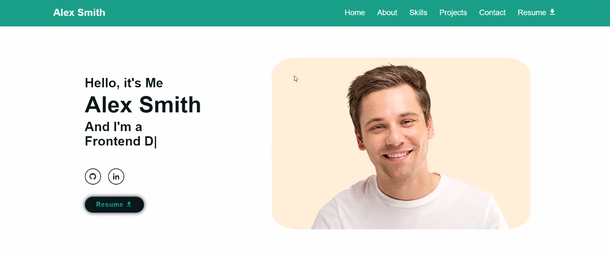
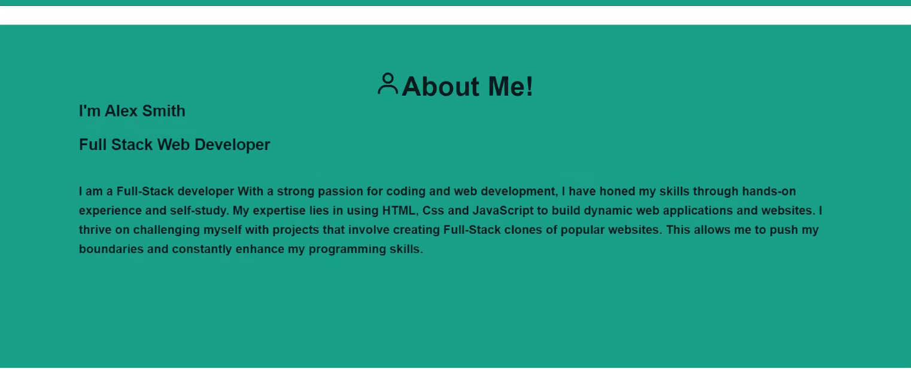
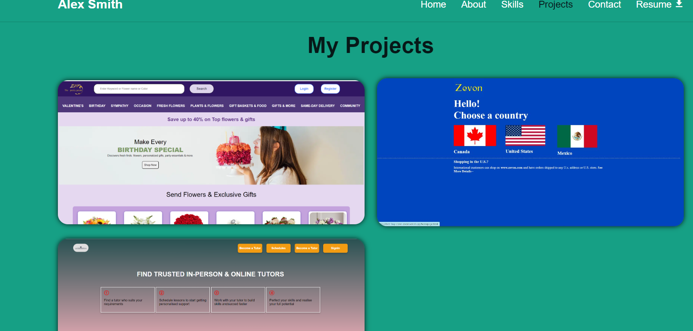
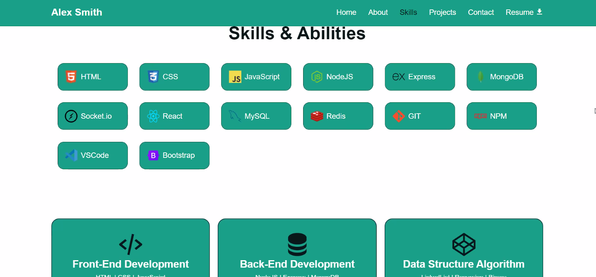
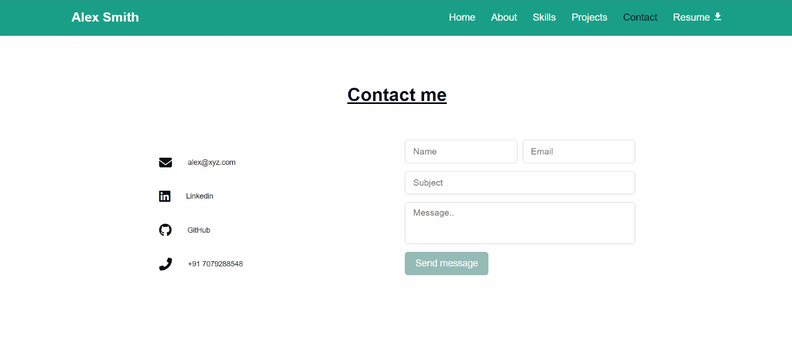

# Project Title

A portfolio for a GitHub repository is a curated collection of projects and code samples that showcases a developer's skills, expertise, and achievements. It serves as a visual representation of their work and is often used by developers to demonstrate their abilities to potential employers, collaborators, or the broader tech community.

## Deployment

Live Link :- https://alex-smith-portfolio.netlify.app/

Github:-( https://github.com/Appy26/axiever_portfolio_assignment)

## Features

- Responsiveness for all screen sizes
- Resume openable as well as downloadable
- Fullscreen mode
- sections were divided 
- Links are working

## Screenshots

- Home Section
 

- About Section

- Projects Section

- Skills Section

- Contacts Section

